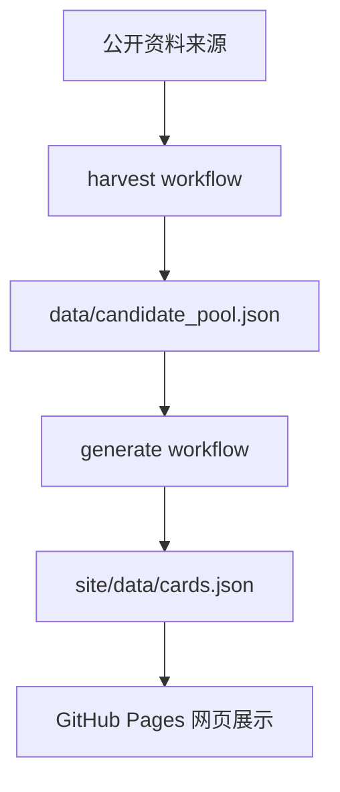
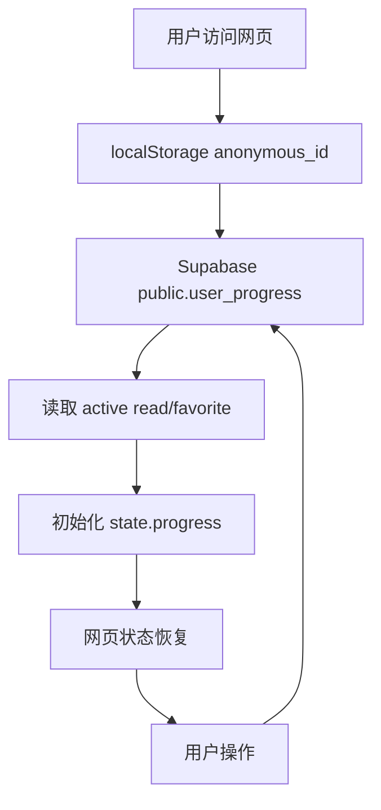

# shiguang Project Status

## 1. 项目简介

shiguang 是一个“小知识探索”项目，用公开资料和 AI 审核生成短知识卡片，并通过静态网页提供每日阅读、随机探索、收藏、已读等个人化体验。

当前目标是保持知识生产流程稳定，同时把用户行为状态逐步迁移到 Supabase，使“用户看到的状态 = Supabase 保存的状态”。

核心功能：

- 从公开来源抓取知识候选。
- 使用 AI 从候选池中提炼、审核并生成正式知识卡片。
- 在网页端展示每日推荐、探索模式和个人记录。
- 使用匿名用户 ID 记录用户行为。
- 使用 Supabase 作为已读、收藏等用户状态的主要来源。

## 2. 当前整体架构

知识生产流程：



用户行为流程：



## 3. 当前目录结构

- `.github/workflows/`
  - `harvest.yml`：定时或手动补充候选池。
  - `generate.yml`：读取候选池并调用 AI 生成正式知识卡。
  - `publish.yml`：发布 GitHub Pages，并生成运行时 Supabase 配置。

- `scripts/`
  - `generate_cards.py`：候选抓取和知识生成的核心脚本，通过 `PIPELINE_MODE` 区分 harvest/generate。
  - `test_sources.py`：公开来源可用性诊断脚本。

- `data/`
  - `candidate_pool.json`：知识候选池。
  - `generation_state.json`：去重和 seen 状态。
  - `harvest_report.json`：候选抓取诊断报告。

- `site/`
  - `index.html`：网页入口。
  - `app.js`：前端主逻辑，包括知识展示、用户状态、Supabase 同步。
  - `service-worker.js`：静态资源缓存策略。
  - `styles.css`：网页样式。
  - `runtime-config.example.js`：Supabase 运行时配置示例。
  - `data/cards.json`：正式知识卡数据。
  - `data/pool_status.json`：候选池和生成状态摘要。

- `supabase/`
  - `user_progress.sql`：当前数据库基准结构。
  - `20260713_*.sql`：已应用的 Supabase migration。

- `tests/`
  - 候选池和生成管线相关测试。

## 4. 数据库设计

Supabase 用于保存网页端用户行为和当前用户状态。当前核心表为：

### `public.user_progress`

字段：

- `id`：`uuid`，主键。
- `anonymous_id`：浏览器匿名用户 ID，保存在 localStorage。
- `user_id`：预留字段，用于未来 Supabase Auth 登录用户。
- `card_id`：知识卡片 ID。
- `status`：行为类型，当前支持 `read`、`favorite`、`explored`。
- `active`：当前状态标记。用于 `read` 和 `favorite`。
- `created_at`：记录创建时间。
- `updated_at`：记录更新时间，由 trigger 自动维护。

状态语义：

- `read`：当前状态型。`active=true` 表示已读，`active=false` 表示取消已读。
- `favorite`：当前状态型。`active=true` 表示已收藏，`active=false` 表示取消收藏。
- `explored`：历史事件型。用于兴趣分析和推荐，不做取消。

RLS 策略：

- anon 可 `SELECT` 匿名用户进度记录。
- anon 可 `INSERT` 带 `anonymous_id` 的 `read`、`favorite`、`explored`。
- anon 可 `UPDATE` 带 `anonymous_id` 的 `read`、`favorite`。
- 不开放 anon 删除。

权限模型：

- anon 仅授予 `SELECT`、`INSERT`、`UPDATE`。
- `user_id` 当前预留，未来登录用户应通过 `auth.uid()` 绑定。

主要索引：

- `user_progress_anon_current_unique`：匿名用户同一 `card_id + status` 的 `read/favorite` 当前状态唯一。
- `user_progress_user_current_unique`：登录用户同一 `card_id + status` 的 `read/favorite` 当前状态唯一。
- `user_progress_anon_active_idx`：按匿名用户读取 active 状态。
- `user_progress_user_active_idx`：为未来登录用户读取 active 状态预留。
- `user_progress_card_status_idx`：按卡片和状态查询。
- `user_progress_created_at_idx`：按创建时间查询历史事件。

## 5. 前端状态管理

当前匿名身份来源：

- localStorage key：`shiguang_anonymous_id_v1`
- 首次访问自动生成，后续访问复用。

当前前端状态：

```js
state.progress = {
  read: Set,
  favorite: Set,
  loaded: boolean
}
```

页面启动流程：

```text
获取 anonymous_id
↓
读取 site/data/cards.json
↓
从 Supabase 查询当前用户 active read/favorite
↓
初始化 state.progress.read / state.progress.favorite
↓
渲染页面
```

Supabase 读取流程：

- 查询 `public.user_progress`
- 条件：
  - `anonymous_id = 当前匿名 ID`
  - `user_id is null`
  - `active = true`
  - `status in (read, favorite)`

用户操作同步流程：

- 已读：
  - 点击标记已读。
  - Supabase 写入或更新 `status=read, active=true`。
  - 成功后更新 `state.progress.read` 并刷新页面状态。

- 取消已读：
  - 点击取消已读。
  - Supabase 更新 `status=read, active=false`。
  - 成功后从 `state.progress.read` 移除。

- 收藏：
  - 点击收藏。
  - Supabase 写入或更新 `status=favorite, active=true`。
  - 成功后更新 `state.progress.favorite`。

- 取消收藏：
  - 点击取消收藏。
  - Supabase 更新 `status=favorite, active=false`。
  - 成功后从 `state.progress.favorite` 移除。

- 探索：
  - 随机探索展示新卡时，向 Supabase 插入 `status=explored` 历史事件。
  - `explored` 不参与取消逻辑。

localStorage 当前仍用于：

- `anonymous_id`
- 每日推荐本地记录
- 随机探索队列
- 稍后再看、不感兴趣
- 后台触发配置和运行状态
- 旧的 read/favorite 数据暂未删除，也暂未迁移

## 6. 当前自动化流程

### `harvest.yml`

作用：补充原始候选池，不调用 AI。

关键数据：

- 输入：公开资料来源。
- 输出：
  - `data/candidate_pool.json`
  - `data/harvest_report.json`
  - `site/data/pool_status.json`

候选池库存策略：

- `HARVEST_TARGET_PENDING=500`
- `HARVEST_REFILL_TRIGGER=300`
- `MAX_POOL_SIZE=1000`

### `generate.yml`

作用：读取候选池，调用 AI 生成并审核知识卡。

关键数据：

- 输入：`data/candidate_pool.json`
- 输出：
  - `site/data/cards.json`
  - `data/candidate_pool.json`
  - `data/generation_state.json`
  - `site/data/pool_status.json`

约束：

- 候选池少于 `MIN_CANDIDATES_TO_GENERATE=20` 时不调用 AI。
- 不负责实时抓取候选。

### `publish.yml`

作用：发布 GitHub Pages。

关键行为：

- 从 GitHub Secrets 读取：
  - `SUPABASE_URL`
  - `SUPABASE_KEY`
- 生成 `site/runtime-config.js`
- 发布 `site/` 到 GitHub Pages。

## 7. 已完成事项

- 候选池系统。
- 候选抓取诊断报告。
- AI 知识生成和审核流程。
- 静态网页展示。
- 每日推荐和探索模式。
- Supabase 接入。
- 匿名用户 ID。
- `user_progress` 当前状态模型。
- RLS 和 anon 权限控制。
- 前端以 Supabase 作为 read/favorite 的主要状态来源。
- `explored` 历史事件记录。
- GitHub Pages 运行时配置。
- Service worker 避免缓存 `runtime-config.js`。

## 8. 当前未完成事项

- 历史 localStorage read/favorite 迁移到 Supabase。
- 登录系统。
- 匿名用户与登录用户的数据合并。
- 多设备同步。
- `knowledge_cards` 动态数据库化。
- 推荐算法。
- 用户行为分析后台。
- read/favorite 与稍后再看、不感兴趣之间的完整云端状态统一。

## 9. 后续开发路线

### Phase 1：用户系统完善

- 实现 localStorage 历史 read/favorite 一次性迁移。
- 增加迁移标记，避免重复迁移。
- 将稍后再看、不感兴趣纳入更完整的状态模型。
- 增加更清晰的 Supabase 同步失败提示和诊断。

### Phase 2：登录同步

- 接入 Supabase Auth。
- 使用 `user_id = auth.uid()` 记录登录用户状态。
- 设计匿名用户到登录用户的数据合并策略。
- 支持电脑和手机跨设备同步。

### Phase 3：知识库动态化

- 评估是否将 `cards.json` 迁移到数据库。
- 设计 `knowledge_cards` 表。
- 保持静态发布和数据库读取之间的兼容路径。

### Phase 4：推荐系统

- 基于 read/favorite/explored 行为建立兴趣特征。
- 改进每日推荐排序。
- 改进随机探索策略。
- 增加冷启动和多领域覆盖控制。

## 10. 开发注意事项

- 不要随意修改 `cards.json` 结构。
- 不要破坏 `candidate_pool.json` 格式和库存策略。
- harvest workflow 只负责抓取候选，不调用 AI。
- generate workflow 只负责读取候选池并生成知识，不实时抓取候选。
- Supabase 是 read/favorite 用户状态的主要来源。
- localStorage 仍保留 anonymous_id 和必要的本地缓存。
- 修改 service worker 时需要同步考虑缓存版本。
- 不要把 Supabase key、OpenAI key、Cloudflare secret 或 GitHub token 写入代码和日志。
- Clash、Mihomo 或代理导致的 Supabase/GitHub 访问失败属于开发环境问题，应优先检查本机代理和 Git 配置。
